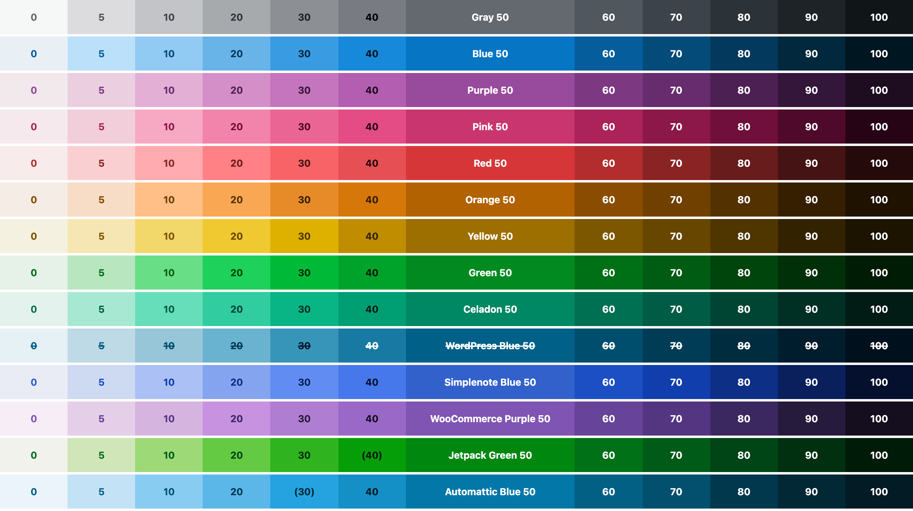

# Color Studio

The color palette for Automattic products, exported in [multiple formats](dist).

[](https://color-studio.blog)

## Using Color Studio as a Dependency

```sh
npm install @automattic/color-studio
```

This package is dependency-free.

### SCSS

```scss
@import "~@automattic/color-studio/dist/color-variables";

button {
  background: $studio-pink-50;
  color: $studio-white;
}
```

### JavaScript

```js
const PALETTE = require( '@automattic/color-studio' );

console.log( PALETTE.colors[ 'Pink 50' ] );
```

The above imports the contents of the [JSON file](dist/colors.json).

## Development

```sh
# Spin up Color Studio
yarn install
yarn test
yarn start

# Generate the JSON file, the stylesheets, and the Sketch Palettes file
yarn palette

# Build the documentation and the examples from `docs/source`
yarn docs

# Build and link the Sketch extension
yarn sketch

# Generate the preview image (by taking a screenshot of the documentation)
yarn meta
```

All the build commands run automatically before every commit.

## License

Color Studio is licensed under [GNU General Public License v2.0 (or later)](LICENSE.md).
